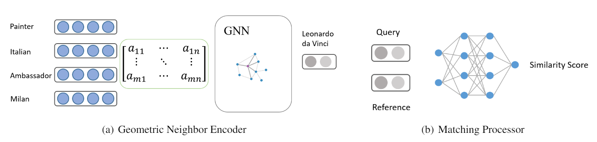

# One-Shot-Knowledge-Graph-Reasoning

PyTorch implementation of CS-6216, One-shot knowledge graph reasoning. 

## Method illustration

The main idea of this geometric neighbor encoder is that encodes the one-hop neighbors of the involved entities,  as defined in ``module.py``.
The main idea of this matching processor is a relation network as defined in ``matcher.py``.

## Steps to run the experiments

### Requirements
* ``Python 3.7 ``
* ``PyTorch 1.3.1``
* ``tensorboardX``
* ``tqdm``
* ``dgl``

### Datasets
* Download datasets [Wiki-One](https://sites.cs.ucsb.edu/~xwhan/datasets/wiki.tar.gz) and [NELL-One](https://sites.cs.ucsb.edu/~xwhan/datasets/nell.tar.gz)

### Pre-trained embeddings
* [Wiki-One](https://drive.google.com/file/d/1_3HBJde2KVMhBgJeGN1-wyvW88gRU1iL/view?usp=sharing)
* [NELL-One](https://drive.google.com/file/d/1XXvYpTSTyCnN-PBdUkWBXwXBI99Chbps/view?usp=sharing)

### Training for GMatching
* With random initialized embeddings: ``CUDA_VISIBLE_DEVICES=0 python trainer.py --max_neighbor 50  --fine_tune``
* With pretrained embeddings: ``CUDA_VISIBLE_DEVICES=0 python trainer.py --max_neighbor 50  --fine_tune --embed_model ComplEx``

### Training 
* GAT-Encoder: ``CUDA_VISIBLE_DEVICES=0 python trainer.py --neighbor gat --max_neighbor 50  --fine_tune --embed_model ComplEx``
* GAT-Encoder: ``CUDA_VISIBLE_DEVICES=0 python trainer.py --neighbor gcn --max_neighbor 50  --fine_tune --embed_model ComplEx``

### Visualization
``tensorboard --logdir logs``
